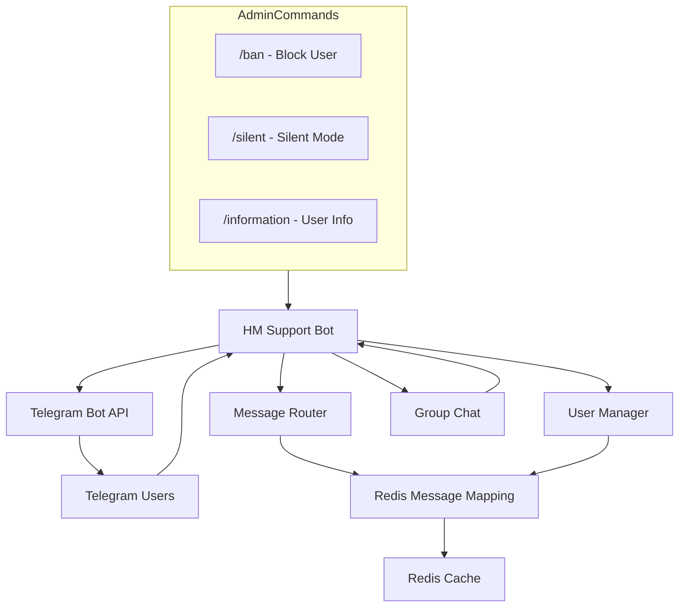

# HM Support Bot

Telegram feedback bot for the HM team. Users message the bot privately — messages are forwarded to a support group chat. Admins reply directly in the group via reply — the response is delivered back to the user's DM.

## Features

- **Message routing** — relay between user DMs and the admin group via reply
- **Edit sync** — message edits are reflected in both directions
- **Media groups** — album support (photos, videos, documents, audio)
- **User blocking** — `/ban` to block/unblock via reply
- **Silent mode** — `/silent` disables reply delivery to a specific user
- **User info** — `/information` shows profile, status, registration date
- **Newsletter** — `/newsletter` for mass notifications (admin only)
- **Multi-language** — UI in English and Russian
- **Redis storage** — message mapping with 30-day TTL, user data in hash

## C4

## Quick Start

1. deps: Linux, Docker, Python 3.11+, Redis
2. env: `cp .env.example .env` and fill in the variables
3. install: `pip install -r requirements.txt`
4. dev: `python -m bot`
5. prod: `docker compose up -d`
